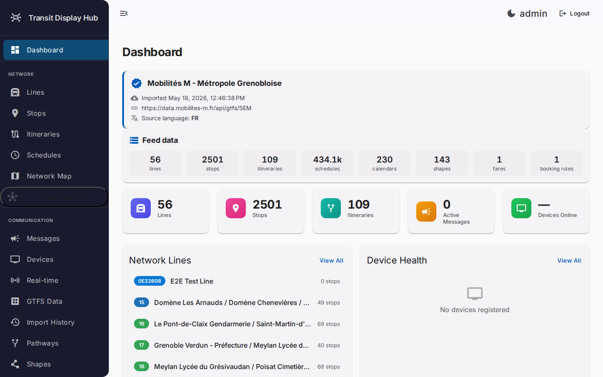
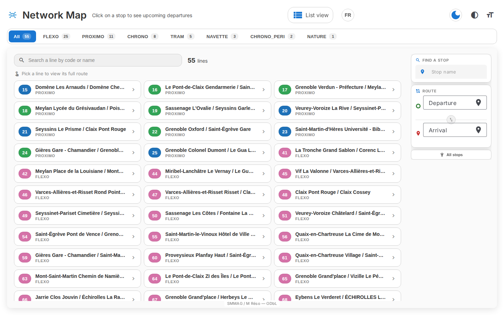
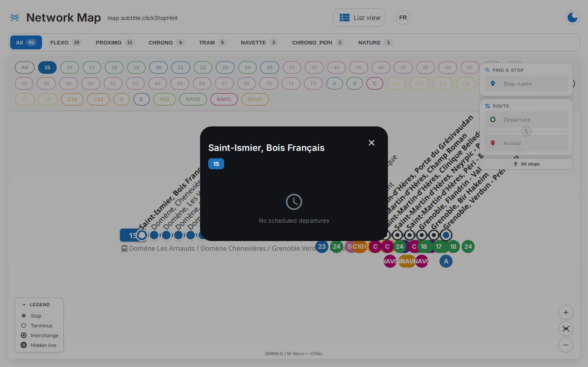
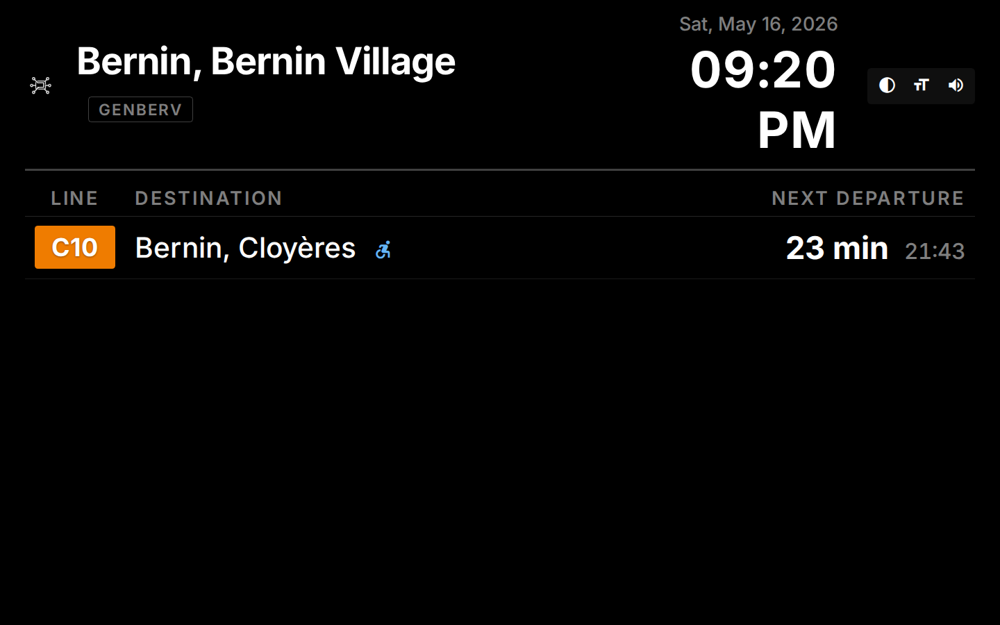
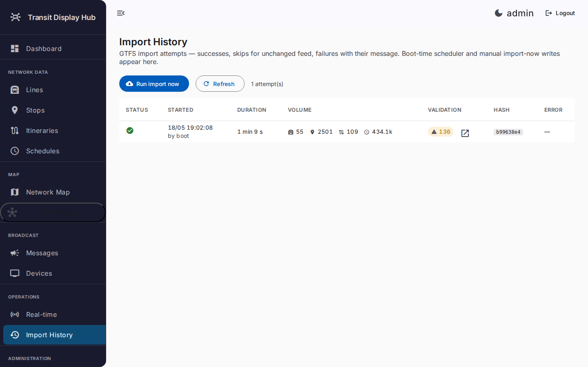
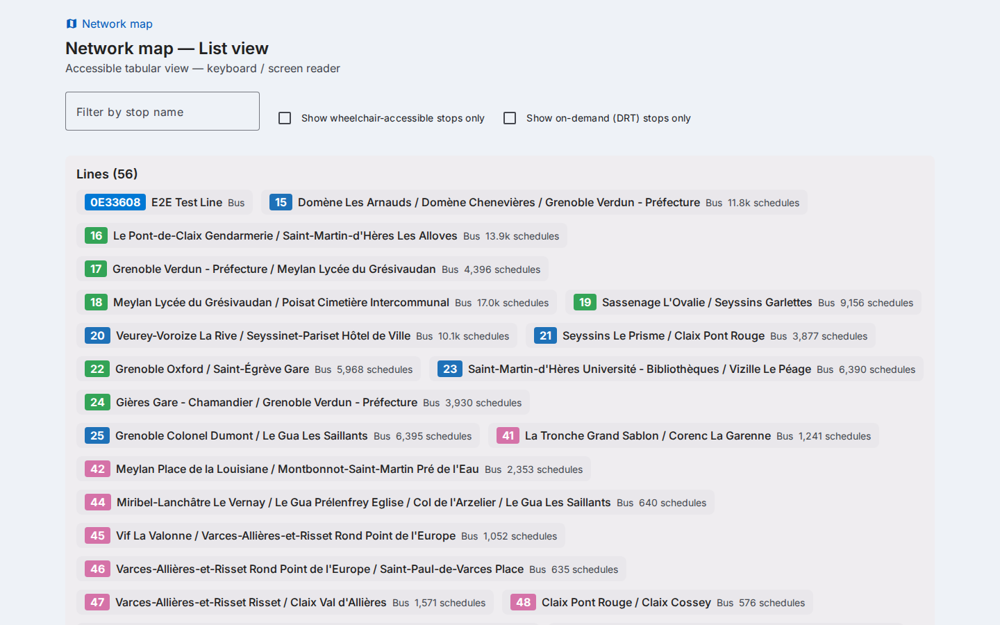

# Transit Display Hub

[](https://github.com/Leigh-Chr/transit-display-hub/actions/workflows/backend.yml)
[](https://github.com/Leigh-Chr/transit-display-hub/actions/workflows/frontend.yml)
[](LICENSE)
[](docs/adr/README.md)
[](CHANGELOG.md)

> **The only open-source transit back-office that combines GTFS
> Schedule, Fares v2, GTFS-flex and GTFS-Realtime in a single
> tool — with WCAG 2.2 AA kiosks and a Raspberry-Pi deployment
> recipe.**

`Transit Display Hub` is an end-to-end real-time passenger
information platform for public transport networks. One
codebase covers three personas — operators import and curate a
GTFS feed through the admin app, passengers read real-time
schedules on the kiosk and consult the schematic map, and
on-call SREs watch Grafana dashboards backed by Prometheus
metrics.

It ships with **100 % GTFS spec coverage**, validated on every
import by the canonical
[MobilityData gtfs-validator][validator]. The 1.x line is tagged
and shipping (current: see the version badge above).

[validator]: https://github.com/MobilityData/gtfs-validator

## Why this exists

Most open-source GTFS tooling stops at *parsing*: validators,
exporters, route-finders. Operators wanting a deployable
back-office (admin UI + kiosk + map + observability) have to
either glue several tools together or pay for a closed SaaS.
Transit Display Hub is the all-in-one alternative: a single
binary per service, runtime-switchable language, accessible by
default, and deployable on a Raspberry Pi for the price of an
SD card.

## Screenshots

> Captures live in [`docs/screenshots/`](docs/screenshots/).
> Drop new ones there and reference them from the markdown
> tables below — keeps the README diff small.

| Surface | Preview |
|---------|---------|
| Admin dashboard      |  |
| Network schematic    |  |
| Stop popup           |  |
| Kiosk arrivals board |  |
| Import audit (with MobilityData report) |  |
| Tabular network view |  |

## Quick start

```bash
git clone https://github.com/Leigh-Chr/transit-display-hub.git
cd transit-display-hub

# Backend (Spring Boot, port 8080)
(cd backend && ./gradlew bootRun)

# Frontend (Angular, port 4200) — second terminal
(cd frontend && npm install && npm start)
```

Open <http://localhost:4200>. Default credentials live in the
[Quick start](#access-and-credentials) section below.

For a turnkey kiosk on a Raspberry Pi, see
[`docs/kiosk-raspberry-pi.md`](docs/kiosk-raspberry-pi.md):

```bash
git clone https://github.com/Leigh-Chr/transit-display-hub.git
cd transit-display-hub
export JWT_SECRET=$(openssl rand -base64 48)
GTFS_FEED_URL=https://your-feed.example.com/gtfs JWT_SECRET=$JWT_SECRET \
  docker compose -f ops/kiosk/docker-compose.kiosk.yml up -d --build
```

## Highlights

- **GTFS Schedule v1 (20 files)** + **Fares v1+v2** + **GTFS-flex
  (canonical 2024)** + **GTFS-Realtime (Alerts + TripUpdates +
  VehiclePositions, including FeedHeader, vehicle descriptors,
  occupancy)**. Validated by [MobilityData gtfs-validator][validator]
  on every import (ADR 0034).
- **Schematic map** with parent / platform collapse, fare-zone
  and accessibility filters, frequency-scaled stroke width,
  TAD-ring indicators, route-finder with PMR pathway penalty
  (ADR 0032), tabular alternative at `/map/list` for
  keyboard / screen reader users.
- **Kiosk** with WebSocket live updates, GTFS-RT delay badges,
  on-demand booking CTA, **WCAG 2.2 AA accessibility**:
  high-contrast mode, large text, vocal Web Speech API
  announcements (ADR 0035).
- **Runtime FR / EN switching** via Transloco — a kiosk in a
  multilingual station flips languages without redeploying
  (ADR 0036).
- **Demand-responsive transit (TAD)**: `booking_rules` resolved
  per arrival, `locations.geojson` zones browsable, in-memory
  point-in-polygon spatial query (ADR 0026 + 0029).
- **Observability**: Prometheus scrape, ready-to-import Grafana
  dashboard at `ops/grafana/transit-display-hub.json`, JMH
  micro-benchmarks for the hot-path utilities (ADR 0027 + 0028).
- **Quality gates**: JaCoCo coverage rule (≥ 55 %), Vitest
  V8 coverage report, Playwright Chromium smoke E2E, two
  GitHub Actions workflows (ADR 0037).

## Tech stack

| Component        | Technology                                          |
| ---------------- | --------------------------------------------------- |
| Backend          | Spring Boot 4.0.2, Java 21                          |
| Frontend         | Angular 21.2, Angular Material (M3), Transloco      |
| Database         | H2 (dev), PostgreSQL (prod)                         |
| Real-time        | WebSocket + STOMP, GTFS-Realtime protobuf           |
| Authentication   | JWT — HttpOnly cookies + rotating refresh tokens (ADR 0039) |
| Tests            | JUnit 5, Vitest, Playwright (E2E smoke)             |
| Benchmarks       | JMH (micro + Spring full-stack)                     |
| Observability    | Spring Actuator + Micrometer + Prometheus + Grafana |
| Validation       | [MobilityData gtfs-validator][validator] 8.0.0      |

## Access and credentials

| URL                                       | Audience          |
| ----------------------------------------- | ----------------- |
| <http://localhost:4200>                   | Admin sign-in     |
| <http://localhost:4200/map>               | Network schematic |
| <http://localhost:4200/map/list>          | Tabular alternative (a11y) |
| <http://localhost:4200/display/{stopId}>  | Public kiosk      |
| <http://localhost:8080/swagger-ui.html>   | OpenAPI explorer  |
| <http://localhost:8080/actuator/prometheus> | Metrics scrape (admin role) |

| Username | Password | Role          |
| -------- | -------- | ------------- |
| admin    | admin123 | Administrator |
| agent    | agent123 | Agent         |

> Change them via `/admin/users` before exposing the install to
> a public network.

## Project structure

```text
transit-display-hub/
├── backend/                 # Spring Boot API (Java 21)
│   ├── src/main/java/com/transit/hub/
│   │   ├── domain/          # Entities, enums, events
│   │   ├── application/     # Services, DTOs, validators
│   │   ├── infrastructure/  # Security, WebSocket, GTFS import
│   │   └── api/             # REST controllers
│   └── build.gradle.kts
├── frontend/                # Angular 21 application
│   └── src/app/
│       ├── core/            # Services, auth, WebSocket, i18n
│       ├── shared/          # Models, components
│       ├── features/        # Admin, display, map
│       └── layouts/         # Admin / display layouts
├── ops/
│   ├── grafana/             # Dashboard JSON + provisioning
│   └── kiosk/               # docker-compose + install.sh
└── docs/
    ├── adr/                 # Architecture Decision Records (40)
    ├── installation.md
    ├── developer-guide.md
    ├── deployment.md
    ├── user-guide.md
    ├── api.md
    ├── kiosk-raspberry-pi.md
    └── screenshots/         # PNG/GIF assets referenced by the README
```

## Documentation

- [Installation guide](docs/installation.md) — dev setup
- [Developer guide](docs/developer-guide.md) — architecture, conventions
- [API documentation](docs/api.md) — REST endpoints
- [User guide](docs/user-guide.md) — admin interface walkthrough
- [Deployment guide](docs/deployment.md) — production hosting
- [Kiosk on a Raspberry Pi](docs/kiosk-raspberry-pi.md)
- [Architecture Decision Records](docs/adr/README.md) — 40 ADRs
- [Changelog](CHANGELOG.md) — version history
- [Contributing](CONTRIBUTING.md), [Code of Conduct](CODE_OF_CONDUCT.md), [Security](SECURITY.md)


## License

This project is licensed under the **GNU Affero General Public License v3.0**. See [LICENSE](LICENSE) for the full text. Network use of a modified version triggers source-disclosure obligations under section 13 of the AGPL.
